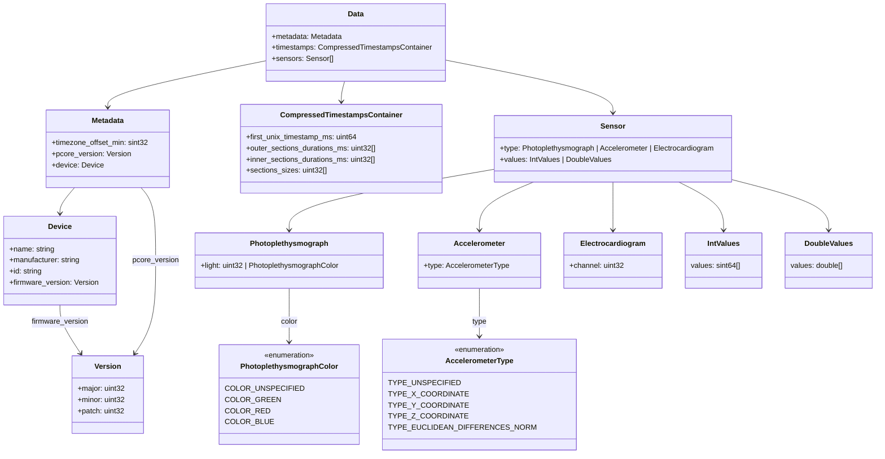

# pcore

## Documentation:
	
    We recommend naming the resulting data files *.pcore (PreventicusCore).

	The basic ideas in the pcore format are 

		1) get rid of timestamps as good as possible 
		2) to store differences instead of absolute values of sensor data.

	Currently, data from Photoplethysmograph (PPG), Accelerometer (ACC), and Electrocardiogram (ECG) sensors are supported. Each sensor’s data is stored in a uniform Sensor structure, which encapsulates sensor-specific metadata and a sequence of measurement values. Depending on the sensor type, these values are stored either as integers (IntValues) or floating-point numbers (DoubleValues).

	Each sensor provides time-synchronized measurements across one or multiple channels. The underlying timestamps for all channels of a sensor are shared and compressed using a structure called CompressedTimestampsContainer. This container represents the measurement timeline by dividing it into sections of constant time intervals. The compressed representation stores the initial timestamp, per-section time deltas, and the number of data points per section.

	For data compression purposes, measurement values are stored in block form:
		•	Integer values are serialized as cumulative differences (deltas), starting from zero.
		•	Floating-point values are stored as-is, without compression.

	The serialized timestamp and value blocks can later be reconstructed using the provided deserialization logic. This ensures both space-efficient storage and accurate recovery of the original measurement series.

	The structure of the serialization format is defined in the Data message. It includes metadata, the compressed timestamps, and a list of sensor messages. For an overview of the involved data structures and their relationships, refer to the class diagram below.

	Example:
	--------
	(each | marks a timestamp, the difference between two | with no space is for this example defined 40 milliseconds, so 1 space is 80 milliseconds)

	  Sequence 1   Sequence 2   Sequence 3   Sequence 4
	  ||||||||||   ||||||||     | | | | |      |||   
	──↑────────────↑────────────↑─↑────────────────────>        
	  a           b         c d                time

	  a: first_unix_timestamp_ms (begin measurement)
	  c to d: inner_sections_durations_ms (time difference in each block)
	  a to a: outer_sections_durations_ms[0] (allways 0)
	  a to b: outer_sections_durations_ms[1] (time differences to predecessor start of block )
	  b to c: outer_sections_durations_ms[2] (and so on)

	unix,         ppg
	1675732789987,38763 <- Begin Block 1
	1675732790027,38771
	1675732790067,38780
	1675732790107,38793
	1675732790147,38784
	1675732790187,38780
	1675732790227,38780
	1675732790267,38783
	1675732790307,38790
	1675732790347,38782
	1675732790467,46321 <- Begin Block 2          
	1675732790507,46327
	1675732790547,46318
	1675732790587,46316
	1675732790627,46313
	1675732790667,46313
	1675732790707,46313
	1675732790747,46336
	1675732790867,58772 <- Begin Block 3
	1675732790947,58774
	1675732791027,58775
	1675732791107,58776
	1675732791187,58773
	1675732791347,19982 <- Begin Block 4
	1675732791387,19982
	1675732791427,19978

	leads to:

	Data: [{
		CompressedTimestampsContainer: {
			first_unix_timestamp_ms: 1675732789987,
			outer_sections_durations_ms: [0, 480, 400, 480],
			inner_sections_durations_ms: [40, 40, 80, 40],
			sections_sizes: [10, 8, 5, 3]
		},
		Sensors: [{
			IntValuesContainer: [{
				values: [8, 9, 13, -9, -4, 0, 3, 7, -8, 7539, 6, -9, -2, -3, 0, 0, 23, 12436, 2, 1, 1, -3, -38791, 0, -4]
			}]
		}]
	}]

## Protobuf Struct

## Serialize

### Description of Timestamp Serialization

Given a sequence of timestamp integers $T = (t_0, t_1, \ldots, t_n \in \mathbb{N})$

Define **sections** by grouping adjacent timestamps with constant deltas:
$$
\delta_i = t_{i} - t_{i-1}, \quad \text{for } i = 1, \dots, n
$$
Each section $ S_j \subseteq T $ satisfies:
$$
\delta_{k} = \text{const} \quad \forall\, t_k, t_{k+1} \in S_j
$$

Let $ s_0 = 0 $ and define section boundaries as:
$$
\text{SectionIdxs} = [s_0, s_1, \dots, s_m], \quad \text{with } t_{s_{j+1}} - t_{s_j} \neq \delta_{s_j+1}
$$

One possible algorithm to do that is: 

<pre>
Algorithm: FindSectionIndices

Input: 
  Timestamps = [t₀, t₁, ..., tₙ]  // ordered list of Unix timestamps

Output:
  SectionIdxs = [s₀, s₁, ..., sₘ] // indices where new sections start

Procedure:
  If Timestamps is empty:
    return empty list

  Initialize SectionIdxs ← [0]
  Set isNewSection ← true

  For i from 1 to length(Timestamps) - 1:
    duration ← Timestamps[i] - Timestamps[i - 1]

    If isNewSection:
      referenceDuration ← duration
      isNewSection ← false

    If duration ≠ referenceDuration:
      Append i to SectionIdxs
      isNewSection ← true

  return SectionIdxs
</pre>

1. Case: length(SectionIdxs) == 0

- $ \text{first\_unix\_timestamp\_ms} = 0 $
- $ \text{outer\_section\_durations\_ms} = [] $
- $ \text{inner\_section\_durations\_ms} = [] $
- $ \text{section\_sizes} = [] $

2. Case: length(SectionIdxs) = 1
	1. Case: length($T$) = 1:
		- $ \text{first\_unix\_timestamp\_ms} = t_0 $
		- $ \text{outer\_section\_durations\_ms}_0 = 0 $
		- $ \text{inner\_section\_durations\_ms}_0 = 0 $
		- $ \text{section\_sizes}_0 = 1 $
	2. Case: length($T$) > 1:
		- $ \text{first\_unix\_timestamp\_ms} = t_0 $
		- $ \text{outer\_section\_durations\_ms}_0 = 0 $
		- $ \text{inner\_section\_durations\_ms}_0 = t_{s_1} - t_{s_0} $
		- $ \text{section\_sizes}_0 = \text{length}(T) $

3. Case: length(SectionIdxs) > 1
	- $ \text{first\_unix\_timestamp\_ms} = t_0 $
	* First $j = 0$
		- $ \text{outer\_section\_durations\_ms}_0 = 0 $
		- $ \text{inner\_section\_durations\_ms}_0 = t_{s_1} - t_{s_0} $
		- $ \text{section\_sizes}_0 = s_{1} $
	* Middel $j = 1, 2, \ldots, \text{length}(SectionIdxs) - 2$
		- $ \text{outer\_section\_durations\_ms}_j = t_{s_{j}} - t_{s_{j-1}} $
		- $ \text{inner\_section\_durations\_ms}_j = t_{s_j+1} - t_{s_j} $
		- $ \text{section\_sizes}_j = s_{j+1} - s_j $
	* Last $m = \text{length}(SectionIdxs)$
		1. Case: $\text{length}(T) - 1 = s_{m-1}$
			- $ \text{outer\_section\_durations\_ms}_{m-1} = t_{s_{m-1}} - t_{s_{m-2}} $
			- $ \text{inner\_section\_durations\_ms}_{m-1} = 0 $
			- $ \text{section\_sizes}_{m-1} = \text{length}(T) - s_{m-1} $ 
		2. Case: $\text{length}(T) - 1 ≠ s_{m-1}$
			- $ \text{outer\_section\_durations\_ms}_{m-1} = t_{s_{m-1}} - t_{s_{m-2}} $
			- $ \text{inner\_section\_durations\_ms}_{m-1} = t_{s_{m-1}+1} -  t_{s_{m-1}} $
			- $ \text{section\_sizes}_{m-1} = \text{length}(T) - s_{m-1} $ 
	

### Description of Integer Value Serialization

Given a sequence of integers $(v_0, v_1, \ldots, v_n \in \mathbb{Z})$, stored in $v$.

The serialization proceeds as follows:

1. If $v$ is empty nothing is serialized.
2. The first value $ v_0 $ is stored directly.
3. Subsequently, the difference to the previous value is stored for each element:

$$d_i = v_i - v_{i-1} \quad \text{for } i = 1,2, \ldots, n \quad \text{with } s_0 = v_0$$

### Description of Double Value Serialization

Given a sequence of real-valued measurements $(v_0, v_1, \ldots, v_n \in \mathbb{R})$, stored in $v$.

The serialization proceeds as follows:

1. If $v$ is empty nothing is serialized.
2. Each value $v_i$ is directly stored:

$$
\hat{v}_i = v_i \quad \text{for } i = 0, 1, \ldots, n
$$

## Deserialize

### Deserialization of Compressed Timestamps

Given:
- An initial timestamp $ t_0 \in \mathbb{N} $
- A list of outer durations $ D^{\text{outer}} = (d_0^{\text{outer}}, \ldots, d_k^{\text{outer}}) \in \mathbb{N}^{k+1} $
- A list of inner durations $ D^{\text{inner}} = (d_0^{\text{inner}}, \ldots, d_k^{\text{inner}}) \in \mathbb{N}^{k+1} $
- A list of section sizes $ S = (s_0, s_1, \ldots, s_k) \in \mathbb{N}^{k+1} $

Each section $ i $ begins at timestamp:

$$
t_i = t_0 + \sum_{j=0}^{i} d_j^{\text{outer}}
$$

The timestamps in section $ i $ are then computed as:

$$
T_i = \left( t_i + n \cdot d_i^{\text{inner}} \right) \quad \text{for } n = 0, 1, \ldots, s_i - 1
$$

The full sequence is reconstructed as the concatenation:

$$
T = T_0 \cup T_1 \cup \cdots \cup T_k
$$

### Deserialization of Integer Values

Given a serialized sequence $s = ( d_0, d_1, \ldots, d_n \in \mathbb{Z})$ of differences $d$

The original values $(v_0, v_1, \ldots, v_n )$ are reconstructed by cumulative summation:

$$
v_i = \sum_{k=0}^{i} d_k \quad \text{for } i = 0, 1, \ldots, n
$$

### Deserialization of Double Values

Given a serialized sequence $s = (\hat{v}_0, \hat{v}_1, \ldots, \hat{v}_n \in \mathbb{R} )$

The deserialized sequence is reconstructed by direct copy:

$$
v_i = \hat{v}_i \quad \text{for } i = 0, 1, \ldots, n
$$
